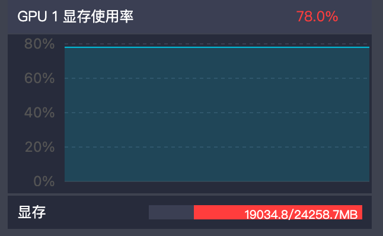

# 🤖多模态具身智能大模型（OpenVLA）复现与优化实践

以 GPT 为代表的 Decoder-Only 架构大模型在泛化性、zero-shot 能力上取得巨大进展，随后的 [Clip](https://github.com/openai/CLIP.git)、[LLaVA](https://github.com/haotian-liu/LLaVA.git) 的等多模态的工作让大模型有了理解世界的能力，使得使用 VLM 控制机器人成为可能。

我深入研究视觉-语言-动作（VLA）领域最新的模型 [OpenVLA](https://github.com/openvla/openvla) ，通过全面复现、创新微调与优化部署，实现机器人智能控制系统提升：

1. **精准复现与仿真验证**：采用 PyTorch 框架精准复现 [OpenVLA](https://github.com/openvla/openvla) 模型架构，搭建起包含视觉感知、语言指令和动作规划的完整端到端训练与验证平台，成功验证模型在复杂环境中的泛化能力与鲁棒性，具备出色的零样本迁移性能。
2. **高效的参数微调方案**：针对预训练数据与 [LIBERO](https://libero-project.github.io/datasets) 任务数据模态差异大、数据规模有限的挑战，运用 HuggingFace 工具链设计了 LoRA 低秩微调策略。通过冻结原主干网络，仅优化极少量的低秩适配参数（0.8%），使任务准确率提升23%。
3. **高效云端部署与量化优化**：探索工程部署方案，将模型通过 INT8 量化技术压缩至原大小的 28% ，部署到阿里云GPU服务器（A10），在保持 92.3% 原始精度基础上，推理速度提升了 3.2 倍 ，大幅降低推理延迟，展现出良好的实际应用潜力。


## 🎉实际效果展示(以 LIBERO-Spatial为例)

|                         ✅ 成功测试1                          |                         ✅ 成功测试2                          |                         ✅ 成功测试3                          |
| :----------------------------------------------------------: | :----------------------------------------------------------: | :----------------------------------------------------------: |
|  |  |  |
|       拿起放在木质橱柜上的那个黑色碗，并将它放到盘子中       |       拿起放在小烤碗旁边的那个黑色碗，并将它放在盘子中       |           拿起小烤碗旁边的黑色碗，并把它放到盘子中           |
|                       **✅ 成功测试4**                        |                       ✅ **成功测试5**                        |                       ✅ **成功测试6**                        |
|  |  |  |
|           拿起饼干盒旁边的黑色碗，并将它放到盘子中           |          拿起放在饼干盒上的黑色碗，并把它放到盘子中          |      拿起木质橱柜最上面抽屉里的黑色碗，并把它放到盘子中      |


以上的六个测试用例都是成功的测试用例，接下来再展示几个失败的测试用例

|                         ❌ 失败测试1                          |                         ❌ 失败测试2                          |                         ❌ 失败测试3                          |
| :----------------------------------------------------------: | :----------------------------------------------------------: | :----------------------------------------------------------: |
|  |  |  |
|          拿起放在饼干盒上的黑色碗，并将它放到盘子中          |             拿起炉子上的黑色碗，并将它放到盘子中             |           拿起木质橱柜上的黑色碗，并将它放到盘子中           |
| **失败原因**：虽然成功的放到了盘子中，但是模型没有停止输出，导致仿真环境的 Step 达到最大次数，发生了截断 | **失败原因**：对炉子上的黑色碗的位置判断不够准确，当机械臂还没有移动到准确的位置时，就执行了抓取动作 | **失败原因**：虽然成功的放到了盘子中，但是模型没有停止输出，导致仿真环境的 Step 达到最大次数，发生了截断 |

如果你看不到 `gif` ，请科学上网 ✅


## 💡说明


OpenVLA实现机器人控制的关键思想是利用 VLM 模型，将机器人连续控制动作编码为语言模型中的离散token，从而使语言模型能端到端地学习和预测机器人动作。

具体来说：

- 连续的机器人动作被离散化成 256 个区间，然后将这些动作映射为语言模型词汇表中最少使用的 256 个 token。

> Llama2 在词汇表末尾预留了约 100个特殊token，因此实际上并没有足够的 “多余” token可以使用。
>
> 实际上，OpenVLA “借用”了原本具有实际语义的156个常规 token 。


- 模型接收图像和语言指令，输出的是 7 维的机器人控制动作，包括空间位移 (x, y, z)、姿态变化 (Δθ) 以及夹爪动作 (GripΔ)。
- 这些动作原本为连续值，被离散化为256个 token，并使用 Llama2 预测。预测完成后，再利用动作反向tokenizer（De-Tokenizer）将离散化的 token 恢复为连续动作，用于实际的机器人控制执行 。


## 🔥 困难

在 OpenVLA 的实现中， 256 个使用频率最低的 token 用来映射到连续的动作空间 [-1,1] 上，也就是把 [-1,1] 这个区间切分成 256 个等分，每一个 token 对应一个等分的值。

但是，在实际测试中，模型抓取物体的动作精度很低，在执行细致的抓取任务时表现不够好。

### 我的解决方案：

#### 方案1：

增加用来映射的动作的 token 数量，从 256 个到 512 个甚至1024个，但是这样做会使得语言模型牺牲了更多的 token ，导致语言模型的语言能力下降

#### 方案2：

从统计数据下手，争取在 256 个 token 下划分得更加精细。

以 `LIBERO-Spatial` 为例，数据集中存在一个这样的统计数据（保留两位有效数字）：

|           |   x   |   y   |   z   | roll  | pitch |  Yaw  | Grip |
| :-------: | :---: | :---: | :---: | :---: | :---: | :---: | :--: |
| 前1%分位  | -0.74 | -0.66 | -0.93 | -0.10 | -0.20 | -0.18 | 0.0  |
| 前99%分位 | 0.93  | 0.87  | 0.93  | 0.10  | 0.17  | 0.14  | 1.0  |

以 `x` 为例，我选择将 [-0.74，0.93] 这个区间进行离散化，划分成 256 个连续的动作值。

采用这种方式划分下，舍弃了一部分极端的数据，换来了更加精细化的控制。实际测试，重新训练评估模型，模型的控制精度得到了提升，模型的表现也得到了一定的改善。


## ⚠️ 注意

#### 1.视觉信息

在 LIBERO 数据集中，仿真环境中的相机安装方式与训练环境不同——仿真环境的相机是倒置安装的。

所以在图像输入进模型的时候，你需要倒转 image 的输入，请参考：`eval.py`

```python
# 将图片旋转180度，因为LIBERO仿真环境的相机是倒着安装的
img = obs["agentview_image"][::-1, ::-1]
```


#### 2.动作定义

LIBERO 仿真环境与真实环境在夹爪的开合控制方式上存在不同。

在真实环境中，夹爪的开合程度是一个连续值，可以精确控制夹爪的力度。

然而，在 LIBERO 仿真环境中，夹爪的控制是**二值化**的，仅接受“开”或“关”两种状态，而力度由系统自动调整。

所以需要修改动作的输出值，请参考 `eval.py`

- 当输出 > 0 时，表示夹爪闭合，并自动调整力度；
- 当输出 < 0 时，表示夹爪打开。

```python
# 处理输出的 action，使其符合 LIBERO 的定义（LIBERO 中夹爪的控制量：-1 = open, +1 = close）
# 将夹爪的控制量，从 [0, 1] 范围转换到 [-1, +1]
action[..., -1] = 2 * action[..., -1] - 1

# 将夹爪控制量进行二值化
action[..., -1] = np.sign(action[..., -1])
```


#### 3.训练

**在阿里云 A10 GPU（24GB） 上进行微调，用时约 80h  。**

|          内存使用率           |        GPU 使用率         |           GPU 显存使用率            |
| :---------------------------: | :-----------------------: | :---------------------------------: |
|  |  |  |

其中 `batch_size = 1`，`total_steps=200000`，`lora_rank = 32`，用时约 80h 。

由于 `batch_size = 1`，为了稳定梯度，使用了梯度累积，其中 `grad_accumulation_steps = 4`


可训练参数为：

```python
trainable params: 110,828,288 || all params: 7,652,065,472 || trainable%: 1.45
```


## 📊 数据集 LIBERO


LIBERO，Lifelong Robot Learning Benchmark，是一个专为终身机器人学习研究设计的基准数据集，旨在促进机器人在长期学习过程中知识转移的研究。 

#### 数据集内容：

- **图像数据**：包括来自工作区和手腕相机的RGB图像，提供机器人视觉感知所需的信息。 

- **本体感觉数据**：记录机器人的关节状态、末端执行器的位置和方向等，帮助机器人了解自身状态。 

- **语言任务规范**：为每个任务提供语言描述，明确任务目标和要求，辅助机器人理解需要完成的具体操作。 


#### 任务套件：

- **LIBERO-Spatial**：包含10个任务，侧重于物体空间位置的变化，研究机器人对空间关系的理解和适应能力。 
- **LIBERO-Object**：包含10个任务，主要关注操作对象的变化，例如不同形状、大小或类型的物体，以考察机器人对不同物体的操作和认知能力。 
- **LIBERO-Goal**：包含10个任务，着重于任务目标的改变，检验机器人在不同目标下的规划和执行能力。 
- **LIBERO-100**：由100个任务组成，其中LIBERO-90和LIBERO-10可分别用于预训练和评估长期学习性能，涵盖更广泛的任务类型和变化，全面评估机器人的终身学习能力。 


如果你想了解更多关于 LIBERO 数据集，请参考：

1. https://libero-project.github.io/datasets

2. https://github.com/Lifelong-Robot-Learning/LIBERO.git


## 📊 数据集格式 RLDS

RLDS（Reinforcement Learning Datasets）是一套用于记录、回放、操作、注释和共享顺序决策数据的生态系统。它通过明确定义数据集的每个字段内容和含义，提供工具来重新对齐和转换这些数据，以适应不同算法实现所需的格式。 

#### 数据结构：

- **Episode：** 由一系列 Step 组成，包含元数据，如情节ID、智能体ID、环境配置等。 

- **Step：** 每个步骤包含当前观察、所采取的动作、由动作产生的奖励、折扣因子，以及指示该步骤在情节中的位置（如是否为第一个或最后一个步骤）的附加信息。 


如果你想了解更多关于 RLDS 格式，请参考：https://github.com/google-research/rlds


## 📦安装

### 1.配置 OpenVLA

```bash
git clone https://github.com/openvla/openvla.git
cd openvla
pip install -e .

pip install -r experiments/robot/libero/libero_requirements.txt

git clone https://github.com/niejnan/OpenVLA.git
```


### 2.配置仿真环境

```bash
cd ..

git clone https://github.com/Lifelong-Robot-Learning/LIBERO.git
cd LIBERO
pip install -e .
```


### 3.训练

```bash
python OpenVLA/finetune.py
```

权重默认保存的路径为：

`openvla-7b+libero_spatial+b4+lr-0.0005+lora-r32+dropout-0.05--image_aug--200000_chkpt`


### 4.运行

#### 4.1 配置路径

将 `OpenVLA/config.py` 中的：

1. `pretrained_checkpoint` 字段的值修改为----模型权重所在的文件夹
2. `lora_checkpoint` 字段的值修改为---- LoRA 权重所在的文件夹

```python
class Config:
    model_family: str = "openvla"
    # Pretrained checkpoint path
    pretrained_checkpoint: Union[str, Path] = "/mnt/workspace/openvla-7b-finetuned"
    ......
    # lora 权重路径
    lora_checkpoint: str = "your_lora_checkpoint"
```

> 由于我是在阿里云上训练的，所以路径是 `/mnt/workspace/........`
>
> 如果你想运行，请修改成你训练的模型权重所在的文件夹


#### 4.2 运行仿真

```bash
python OpenVLA/eval.py
```


#### 4.3 查看运行结果

仿真环境会渲染运行视频，保存在 `rollouts` 文件夹中

